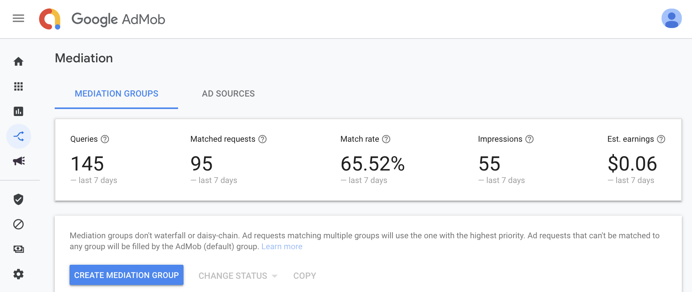
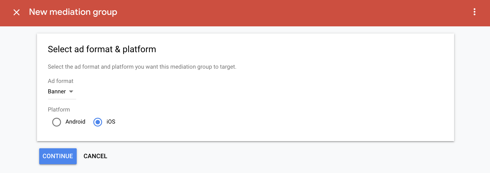
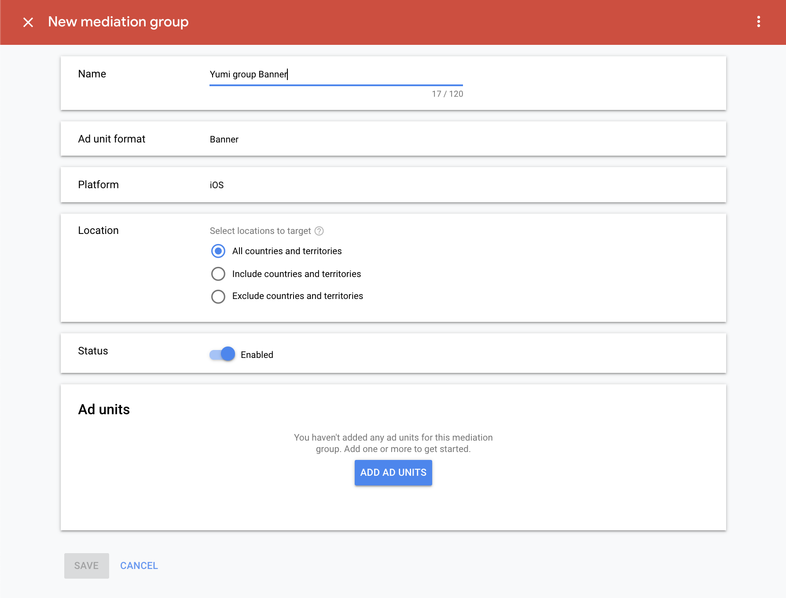
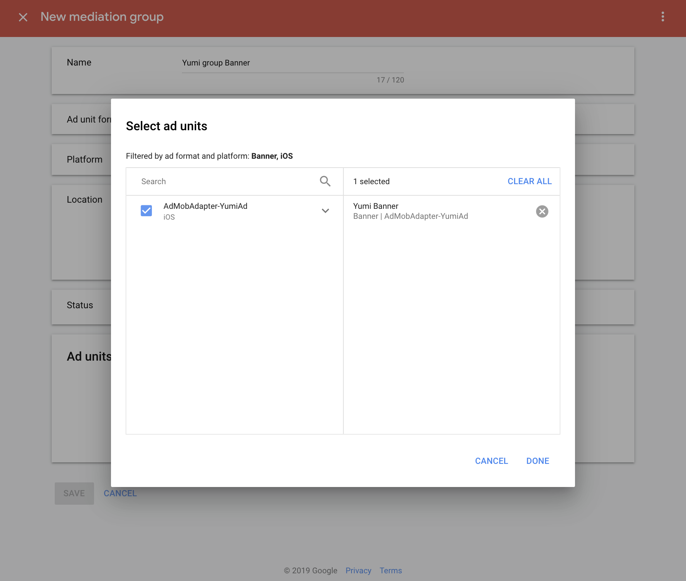
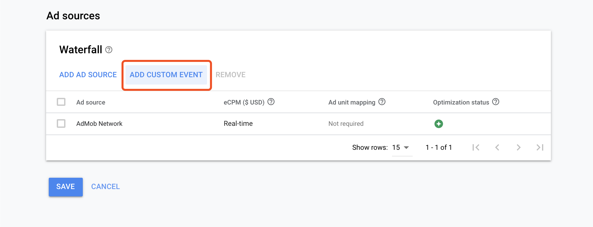
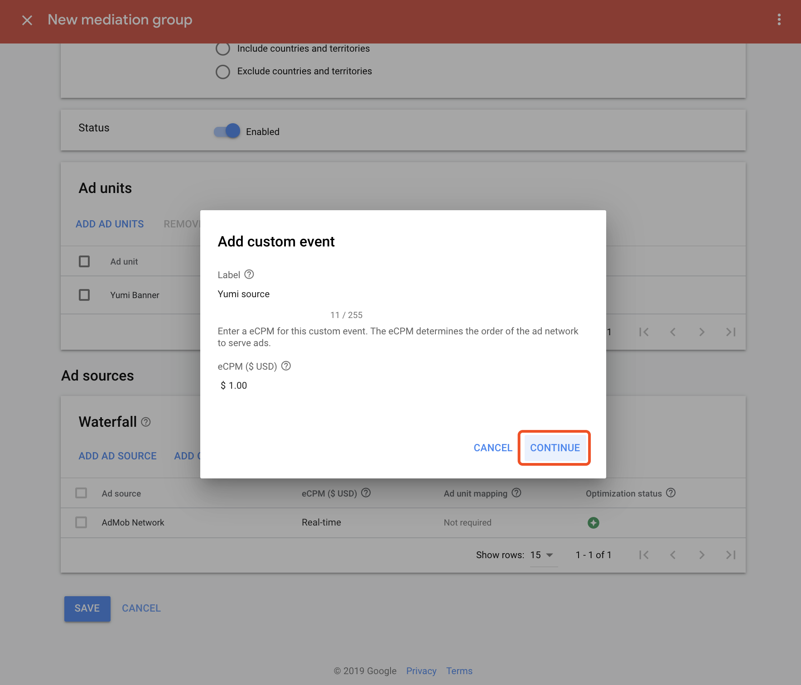
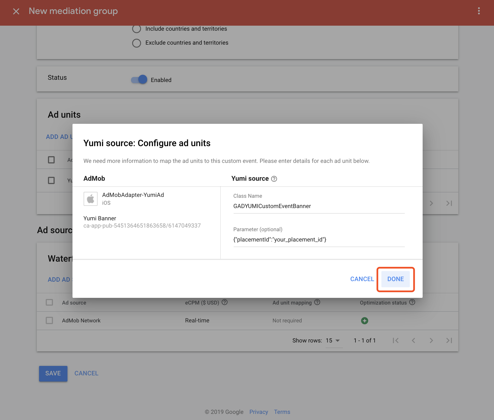
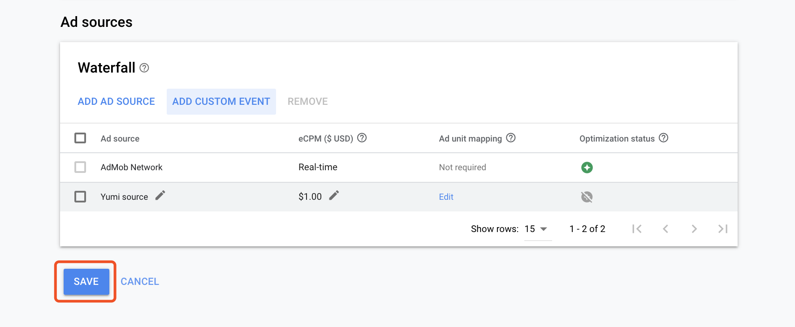

- [1 Import YumiAd SDK and AdMob SDK](#1-import-yumiad-sdk-and-admob-sdk)
    - [1.1 Import YumiAd SDK and AdMob SDK](#11-import-yumiad-sdk-and-admob-sdk)
        - [CocoaPods (preferred)](#cocoapods-preferred)
        - [Manual download](#manual-download)
    - [1.3 Import the Yumi Adapters](#13-import-the-yumi-adapters)
        - [1.3.1 Banner Adapter](#131-banner-adapter)
        - [1.3.1 Interstitial Adapter](#131-interstitial-adapter)
        - [1.3.1 Reward Video Adapter](#131-reward-video-adapter)
- [2  Add YumiAd source into AdMob platform](#2-add-yumiad-source-into-admob-platform)
- [3 Testing ID](#3-testing-id)

## 1 Import YumiAd SDK and AdMob SDK
### 1.1 Import YumiAd SDK and AdMob SDK
#### CocoaPods (preferred)
The simplest way to import the SDK into an iOS project is to use [CocoaPods](https://guides.cocoapods.org/using/getting-started). Open your project's Podfile and add this line to your app's target:
```ruby
 pod 'YumiAdSDK'
 pod 'Google-Mobile-Ads-SDK'
```
Then from the command line run:
```
pod install --repo-update
```

#### Manual download

Manual import Admob SDK. [Integrated Guide](https://developers.google.com/admob/ios/quick-start) 。<br>
 Manual import YumiAdSDK. [Integrated Guide](https://github.com/yumimobi/YumiAdSDKDemo-iOS/blob/master/normalDocuments/YumiAdSDK%20for%20iOS(zh-cn).md#%E6%8E%A5%E5%85%A5%E6%96%B9%E5%BC%8F)。

### 1.3 Import the Yumi Adapters
 import the following files into your Xcode project:
#### 1.3.1 Banner Adapter
[GADYUMICustomEventBanner.h](https://github.com/yumimobi/AdMobAdapter-YumiAd-iOS/blob/master/AdMobAdapter-YumiAd-iOS/Banner/GADYUMICustomEventBanner.h)<br>
[GADYUMICustomEventBanner.m](https://github.com/yumimobi/AdMobAdapter-YumiAd-iOS/blob/master/AdMobAdapter-YumiAd-iOS/Banner/GADYUMICustomEventBanner.m)

#### 1.3.1 Interstitial Adapter
[GADYUMICustomEventInterstitial.h](https://github.com/yumimobi/AdMobAdapter-YumiAd-iOS/blob/master/AdMobAdapter-YumiAd-iOS/Interstitial/GADYUMICustomEventInterstitial.h)<br>
[GADYUMICustomEventInterstitial.m](https://github.com/yumimobi/AdMobAdapter-YumiAd-iOS/blob/master/AdMobAdapter-YumiAd-iOS/Interstitial/GADYUMICustomEventInterstitial.m)

#### 1.3.1 Reward Video Adapter
[GADYUMICustomEventRewardVideo.h](https://github.com/yumimobi/AdMobAdapter-YumiAd-iOS/blob/master/AdMobAdapter-YumiAd-iOS/Reward%20Video/GADYUMICustomEventRewardVideo.h)<br>
[GADYUMICustomEventRewardVideo.m](https://github.com/yumimobi/AdMobAdapter-YumiAd-iOS/blob/master/AdMobAdapter-YumiAd-iOS/Reward%20Video/GADYUMICustomEventRewardVideo.m)


## 2 Add YumiAd source into [AdMob platform](https://apps.admob.com/v2/home)
The following example is to configure Yumi source on an existing application (AdmobAdapter-YumiAd) with an existing ad slot (Yumi Banner). For reference only, if the actual situation does not match this, please handle it as appropriate.

1. open "[Mediation](https://apps.admob.com/v2/mediation/groups/list)" then click "CREATE MEDIATION GROUP"



2. Choose the advertising format and platform you want to use. YumiAd currently supports Banner, Interstitial and Rewarded Video. Here is Banner as an example. Click "CONTINUE" to go to the next step.



3. Enter Name, other settings remain the default, or refer to the settings below. Click "ADD AD UNIT" to select the ad slot you want to add.



4. In the Select ad Units dialog, select the ad unit and click "DONE" to save.



5. Click "ADD CUSTOM EVENT" to add a custom ad source.



6. Enter the name of the third-party ad source, here is Yumi source as an example, you can customize it according to your needs, and set the price of the third-party ad source as needed.



7. Configure the Yumi source. Fill in the full adapter class name in the Class Name, and take the adapter class name in the demo as an example.<br>
Banner class name is  `GADYUMICustomEventBanner`<br>
Interstitial class name is `GADYUMICustomEventInterstitial`<br>
Reward Video class name is  `GADYUMICustomEventRewardVideo`<br>

You need fill in the slotId into the Parameter box, click "DONE" to complete the configuration of YumiAd
```json
{"placementId" : "your_placement_id"}
```
In the test phase, you can replace **your_placement_id** with **test id** and change to your own slotId when your app goes online.



8. In the Ad source list, you can see the set ad source Yumi source, click "SAVE" to complete the Mediation configuration.



## 3 Testing ID

You can use the following ID to test in the test phase, the test ID will not generate revenue, please use your own slotId when the application goes online.

| Ad Formats | Test Placement ID |
| :------: | :--------- |
|  Banner  | l6ibkpae   |
|  Interstitial | onkkeg5i   |
|  Reward Video | 5xmpgti4   |